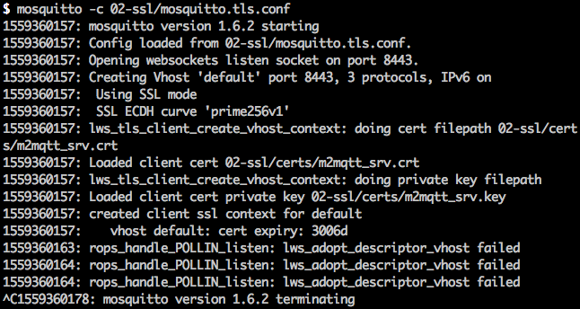

# Wise Mosquitto Setup

Attempted to setup Advantech WISE 4050 device with Mosquitto by following the tutorial from [here](https://support.advantech.com/support/KnowledgeBaseSRDetail_New.aspx?SR_ID=1-1L5RLK8&Doc_Source=Knowledge+Base).


## Pre-requisite

- [Mosquitto](https://mosquitto.org/)

## Note

Please execute the following commands on the root folder.


### Attempt 1: Non-SSL Mode

```
mosquitto -c 01-non-ssl/mosquitto.conf
```

Received the following error:


### Attempt 2: SSL Mode

```
mosquitto -c 02-ssl/mosquitto.tls.conf
```

Received the following error:


